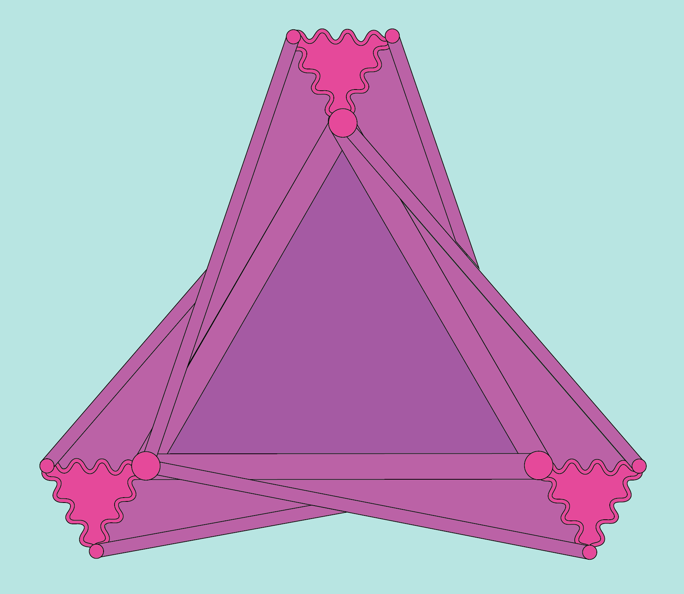

# HomCV: Homotopical Computer Vision 

---
HomCV is an open source Python library applying homotopy theoretic methods to computer vision.

## Installation

Use the package manager [pip](https://pip.pypa.io/en/stable/) to install HomCV.

```bash
pip install homcv
```

## Examples

```python
>>> from homcv.betti_numbers import betti_numbers
>>> betti_numbers(circle_greyscale_image) 
array([1, 0], dtype=int8)
```

## Contributing

Pull requests are welcome. For major changes, please open an issue first to discuss what you would like to change.

Please make sure to update tests as appropriate.

## License
[MIT](https://choosealicense.com/licenses/mit/)